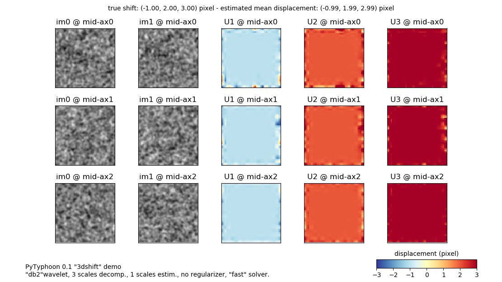
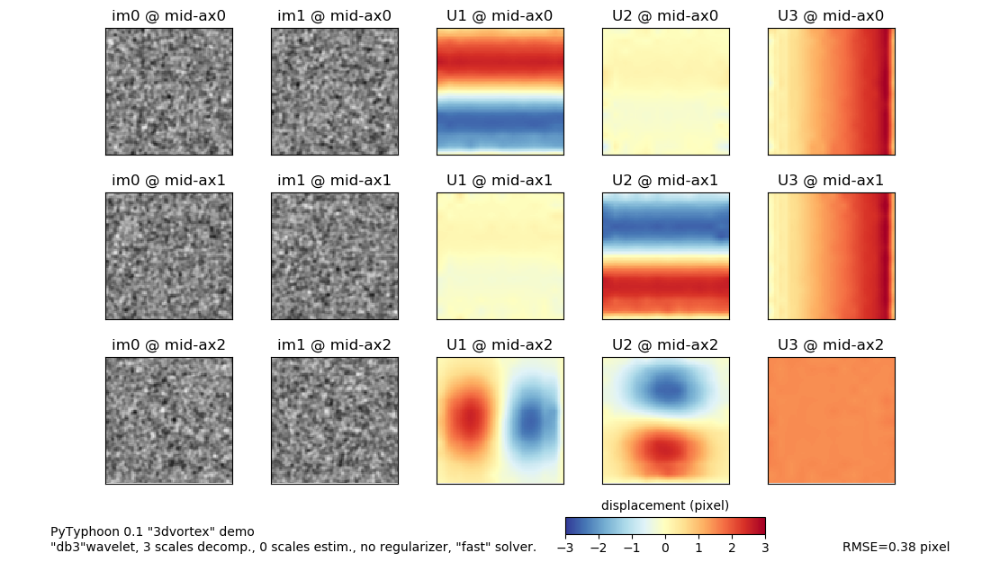

# PyTyphoon
Python implementation of [Typhoon motion estimator](http://www.pierrederian.net/typhoon.html): dense estimation of 2D/3D optical flow on wavelet bases, primarily aimed at **fluid motion estimation**.

## Important remarks
At the moment, the wavelet-based data DFD term [(D&eacute;rian et al., 2013)] only is provided: the **high-order regularizers** [(Kadri-Harouna et al., 2013)] **are not included** in this implementation.

The reference implementation used in [(D&eacute;rian et al., 2015)] and [(D&eacute;rian et al., 2017)] is written in C++ and GPU-accelerated with CUDA, and contains the high-order regularizers. It is the property of Inria (FR) and the CSU Chico Research
Foundation (Ca, USA), and can be licensed from these institutions.
*This Python implementation is not the same as the
reference* for many reasons, and it is obviously much slower.

## Requirements
- [Numpy, Scipy](https://scipy.org/);
- [PyWavelets](https://github.com/PyWavelets/pywt);
- [Matplotlib](https://matplotlib.org/) for the demos.

Tested with Anaconda Python 3.6.1, Numpy 1.12.1, Scipy 0.19.1, PyWavelet 0.5.2.

## Todo
- some regularizers;
- support of masks;
- alternative penalization functions;
- divergence-free wavelets;
- ...

## Usage
The `Typhoon` class can be imported from other modules/scripts to perform estimations as needed.

The script can also work as a standalone estimator in simple cases, e.g.:
```
python pytyphoon.py -i0 path/to/im0.jpg -i1 path/to/im1.jpg -wav 'db3' --display
```
will solve the problem for image pair (`im0.jpg`, `im1.jpg`) and wavelet Daubechies-3.
See `python pytyphoon.py -h` for the complete list of parameters.

## Demos

These demos are shipped with the project.

### (2D) Synthetic particle images
Simple 2d estimation using synthetic particle images (256x256 pixels) originally created for the [FLUID project](http://fluid.irisa.fr/data-eng.htm) (image database #1). Run:
```
python pytyphoon.py --demo particles
```


### (3D) Homogeneous shift
Simple 3d estimation using synthetic images (64x64x64 pixels) obtained by filtering random normal noise at various scales. The displacements are integer shifts along each of the 3 dimensions. Run:
```
python pytyphoon.py --demo 3dshift
```


### (3D) Homogeneous shift
Simple 3d estimation using synthetic images (96x96x96 pixels) obtained by filtering random normal noise at various scales. The displacement field is a column vortex (first two axes) with an updraft increasing linearly along the third axis. Run:
```
python pytyphoon.py --demo 3dvortex
```


## References
- [(D&eacute;rian et al., 2017)]
    D&eacute;rian, P. & Almar, R.
    "Wavelet-based Optical Flow Estimation of Instant Surface Currents from Shore-based and UAV Video"
    _IEEE Transactions on Geoscience and Remote Sensing_, Vol. 55, pp. 5790-5797, 2017.
- [(D&eacute;rian et al., 2015)]
     D&eacute;rian, P.; Mauzey, C. F. and Mayor, S. D.
    "Wavelet-based optical flow for two-component wind field estimation from single aerosol lidar data"
    _Journal of Atmospheric and Oceanic Technology_, Vol. 32, pp. 1759-1778, 2015.
- [(D&eacute;rian et al., 2013)]
    D&eacute;rian, P.; H&eacute;as, P.; Herzet, C. & M&eacute;min, E.
    "Wavelets and Optical Flow Motion Estimation".
    _Numerical Mathematics: Theory, Method and Applications_, Vol. 6, pp. 116-137, 2013.
- [(Kadri-Harouna et al., 2013)] Kadri Harouna, S.; D&eacute;rian, P.; H&eacute;as, P. and     M&eacute;min, E.
   "Divergence-free Wavelets and High Order Regularization".
   _International Journal of Computer Vision_, Vol. 103, pp. 80-99, 2013.

[(D&eacute;rian et al., 2017)]: http://ieeexplore.ieee.org/stamp/stamp.jsp?tp=&arnumber=7964775&isnumber=8049540
[(D&eacute;rian et al., 2015)]: http://journals.ametsoc.org/doi/abs/10.1175/JTECH-D-15-0010.1
[(D&eacute;rian et al., 2013)]: https://www.cambridge.org/core/journals/numerical-mathematics-theory-methods-and-applications/article/wavelets-and-optical-flow-motion-estimation/2A9D13B316F000F0530AD42621B42FFD
[(Kadri-Harouna et al., 2013)]: https://link.springer.com/article/10.1007/s11263-012-0595-7
